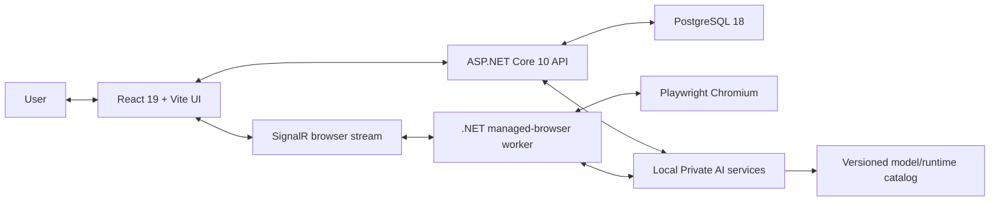
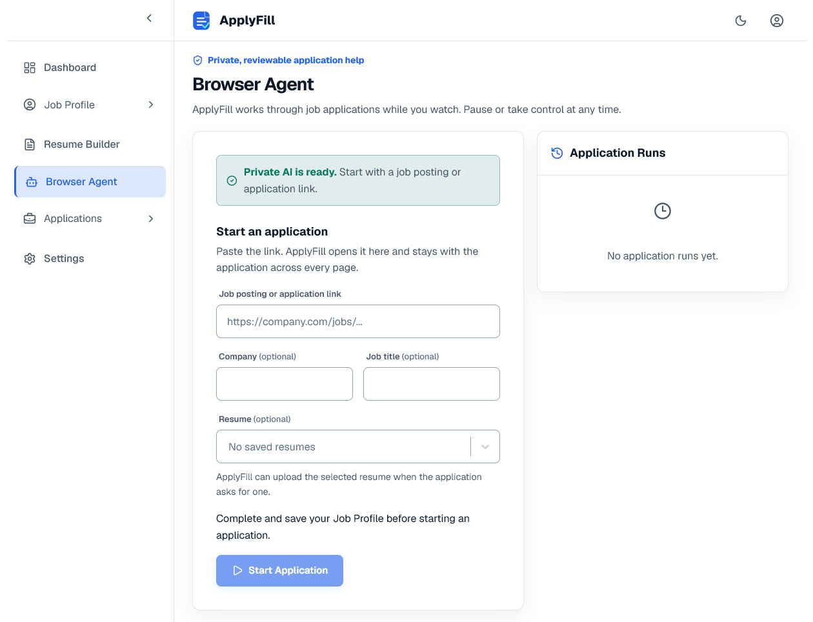
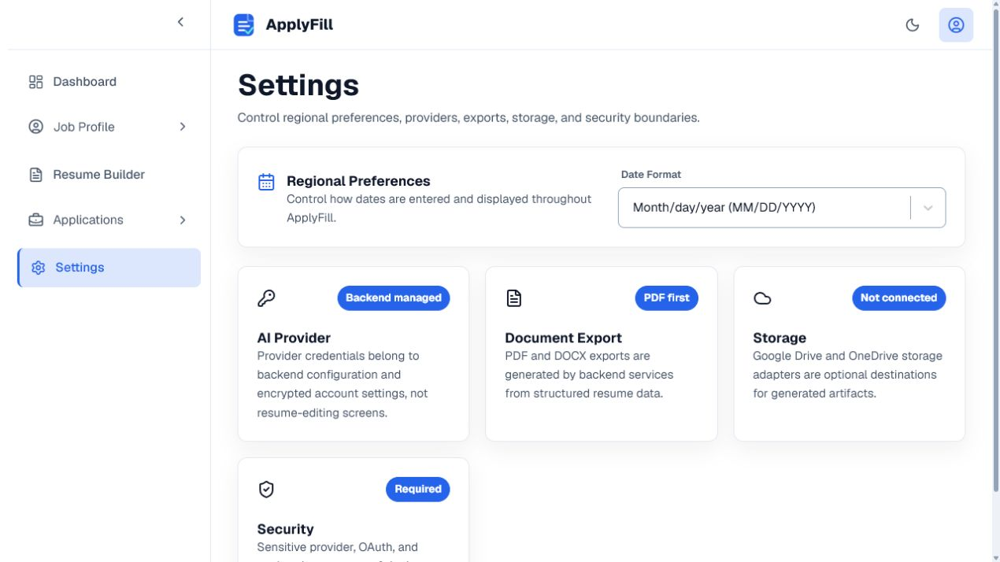
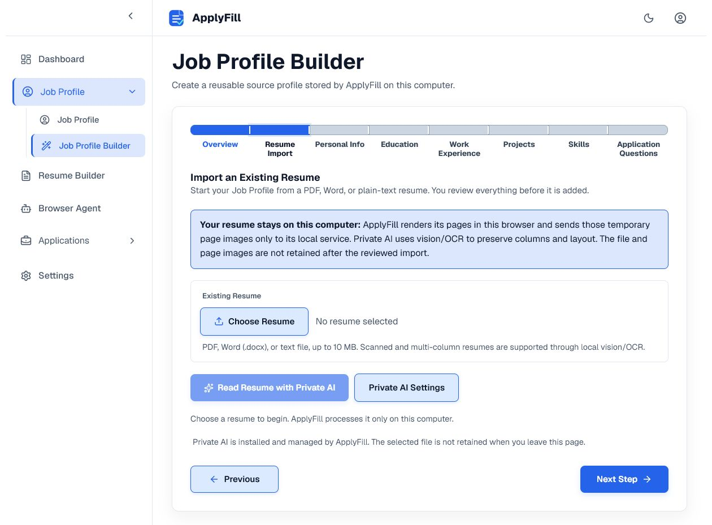
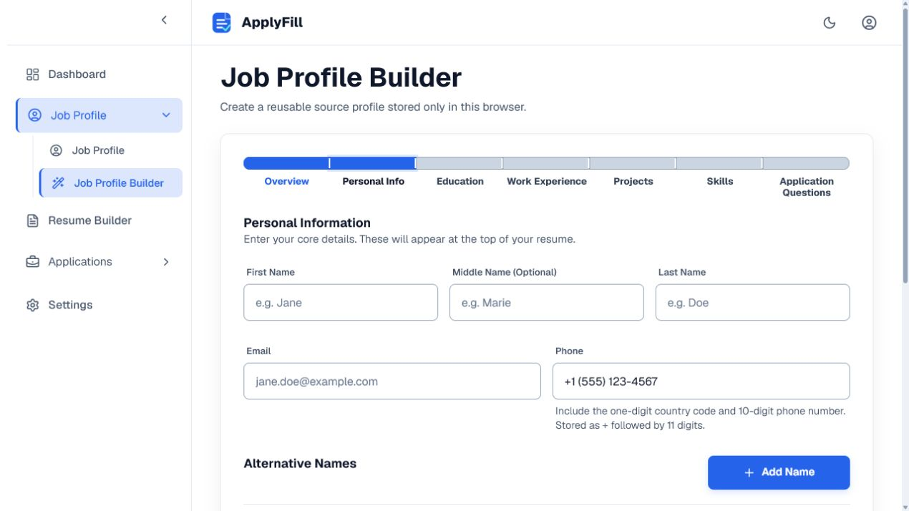
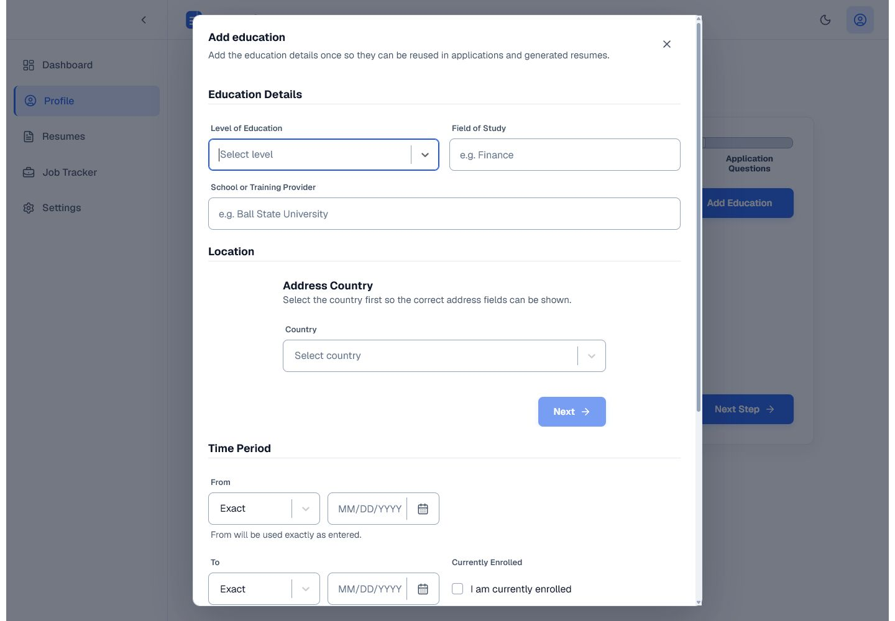
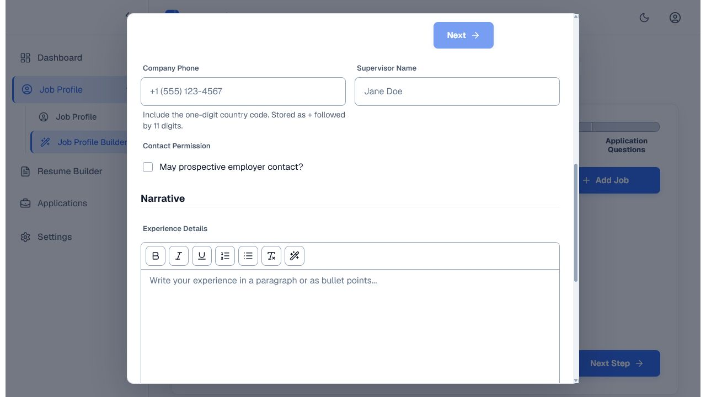
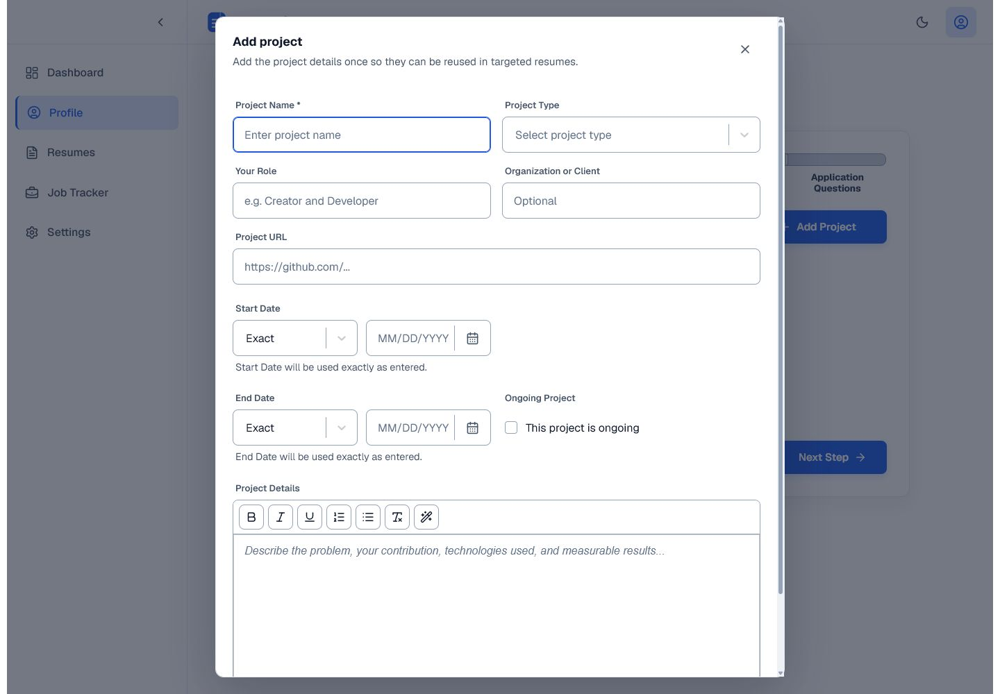
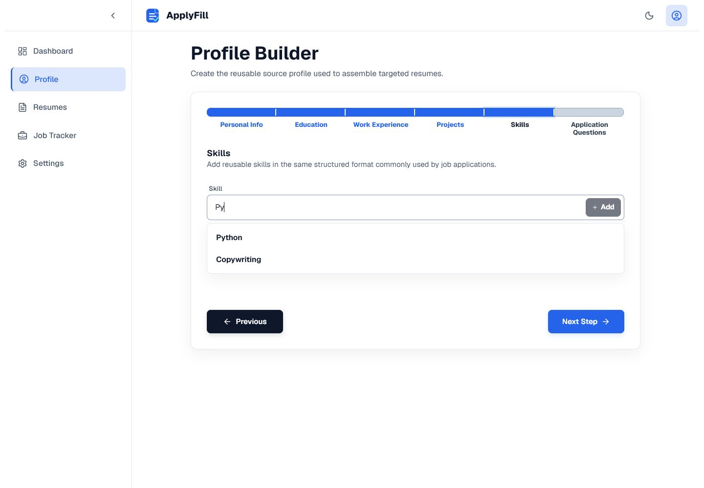
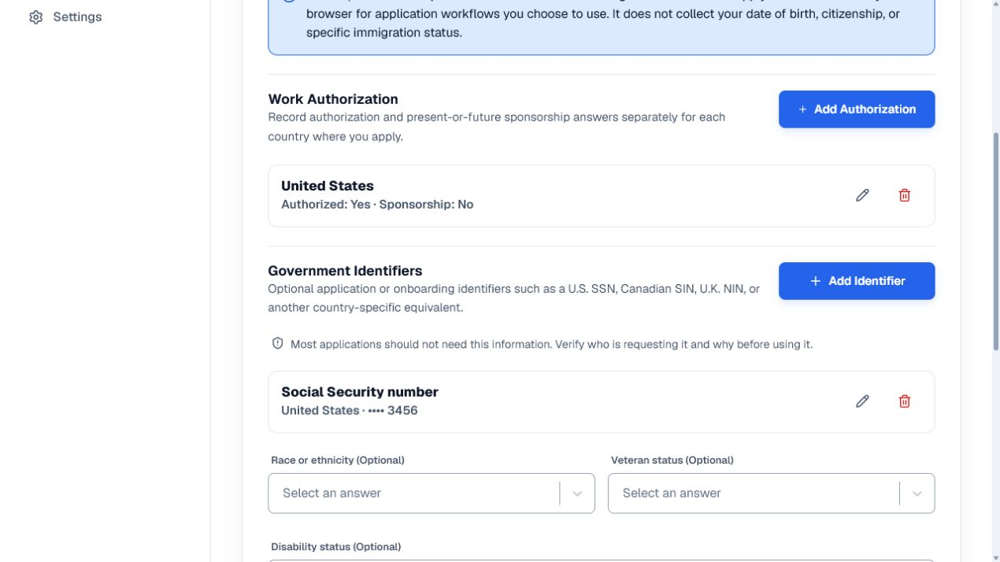

<div align="center">
  
  <h1>ApplyFill</h1>
  <p><strong>Enter job-application information once. Reuse it across applications and targeted resumes.</strong></p>
</div>

<p align="center">
  
  
  
  
  
</p>

ApplyFill is a privacy-focused job-application workspace. It keeps a reusable Job Profile, resumes, tracked applications, and Browser Agent history on the user's computer. Its managed browser works through multi-page applications inside the normal ApplyFill layout while the user watches, pauses, stops, or takes control at any time.

## What is implemented

- A .NET 10 API with profile, resume, job-application, and application-run resources.
- PostgreSQL 18 as the authoritative local datastore, including encrypted application-only profile data and optimistic concurrency.
- A managed Chromium worker built with Microsoft Playwright.
- A multi-page Browser Agent surface with live frames, reconnecting updates, activity history, questions, pause/resume, take-control, stop, and final-review controls.
- Provider-neutral local model/runtime manifests under `private-ai/catalog/` so evaluated vision and OCR models can be replaced without changing product workflows or database schemas.
- Vision/OCR resume import with overwrite confirmation, retained original-file preview, structured validation, and review before profile replacement.
- A shared PDF viewer with thumbnails, page navigation, zoom, fullscreen, and download across resume import and Resume Builder, plus PDF, DOCX, and JSON exports.

## Privacy boundary

ApplyFill is local software, not a cloud account:

- User records are stored in PostgreSQL on the user's computer.
- Managed Chromium sessions, screenshots, prompts, model responses, artifacts, and action history stay on that computer unless the user intentionally exports or shares them.
- Private AI runs through local model services. The ordinary UI does not expose model providers, runtimes, ports, quantization, or processor settings.
- Sensitive application-only fields are separated from ordinary profile content and protected with installation-bound ASP.NET Core Data Protection keys. Back up the matching keys with the database; neither is useful alone after a restore.
- The Browser Agent necessarily communicates with the job sites the user opens. Those sites receive data only through normal browsing and application submission.
- Final submission requires explicit approval. ApplyFill does not silently submit an application.

Local operation does not protect an unlocked computer, compromised operating system, malicious job site, screen capture, or files copied outside ApplyFill. See [Privacy and security](docs/privacy-security.md).

## Architecture



| Area | Software | Responsibility |
| --- | --- | --- |
| Application API | ASP.NET Core 10 | Local HTTP API, validation, concurrency, health, and persistence boundaries |
| Data | PostgreSQL 18.4 | Authoritative profiles, resumes, applications, runs, checkpoints, and audit records |
| Browser automation | Microsoft Playwright 1.61 + managed Chromium | Navigation, observation, user input, uploads, and multi-page continuity |
| Frontend | React 19, TypeScript 6, Vite 8 | ApplyFill shell, editors, Browser Agent controls, and review surfaces |
| Private AI | Versioned native runtime/model adapters | Local vision, OCR, planning, resume import, and writing assistance |
| Realtime | SignalR | Run updates, frame notices, reconnect, and control state |

The public API is versioned under `/api/v1/`. Development OpenAPI is available at `/openapi/v1.json`. Browser Agent streaming uses `/hubs/browser-agent`.

## Requirements

- Windows 10/11 or another supported .NET/Playwright development host.
- [.NET 10 SDK](https://dotnet.microsoft.com/download/dotnet/10.0) matching `global.json`.
- [Node.js](https://nodejs.org/) with Corepack and pnpm 11.7.
- Docker Desktop or another Compose-compatible engine for the PostgreSQL 18 development database.
- Sufficient local disk for Chromium, the database, artifacts, and user-approved Private AI model downloads.

An NVIDIA GPU is optional. Evaluated CPU and partial-offload paths are represented separately in the model catalog; ApplyFill chooses an evaluated option automatically.

## Development setup

From the repository root, start the complete local stack with one command:

```powershell
pwsh -NoProfile -File .\scripts\local\start.ps1
```

The launcher checks prerequisites, starts PostgreSQL, applies database migrations, starts the API and managed-browser worker, and opens the Vite app at `http://127.0.0.1:5173/`. It uses Corepack's project-pinned pnpm, so a global `pnpm` command is not required.

Use the companion scripts to inspect or stop the stack:

```powershell
pwsh -NoProfile -File .\scripts\local\status.ps1
pwsh -NoProfile -File .\scripts\local\stop.ps1
```

For individual service development, the equivalent manual sequence is:

```powershell
Copy-Item .env.example .env
# Replace both placeholder database passwords in .env.
docker compose up -d postgres

dotnet tool restore
dotnet restore ApplyFill.slnx
dotnet ef database update --project src/ResumeBuilder.Infrastructure --startup-project src/ResumeBuilder.Api

dotnet run --project src/ResumeBuilder.Api
```

In a second terminal:

```powershell
dotnet build src/ResumeBuilder.BrowserWorker/ResumeBuilder.BrowserWorker.csproj
pwsh src/ResumeBuilder.BrowserWorker/bin/Debug/net10.0/playwright.ps1 install chromium
dotnet run --project src/ResumeBuilder.BrowserWorker
```

In a third terminal:

```powershell
cd frontend
corepack pnpm install
corepack pnpm dev -- --host 127.0.0.1 --port 5173
```

Open `http://127.0.0.1:5173/`. Local service addresses belong in development configuration; ordinary users should never configure ports or start individual services.

## Verification

```powershell
dotnet build ApplyFill.slnx --no-restore
dotnet test ApplyFill.slnx --no-build

cd frontend
corepack pnpm lint
corepack pnpm test
corepack pnpm build
```

PostgreSQL integration tests use Testcontainers and require a running container engine. Browser-worker tests use synthetic local fixtures rather than mutable public job sites.

Database maintenance scripts are under `scripts/database/`:

```powershell
pwsh scripts/database/backup.ps1
pwsh scripts/database/restore.ps1 -BackupFile <path>
pwsh scripts/database/reset-development.ps1
```

See [Development guide](docs/development.md) for service configuration and troubleshooting.

## Browser Agent controls

The Browser Agent is available from the **Browser Agent** tab of a saved application in the Job Tracker.

- **Pause** stops new agent actions at a safe boundary.
- **Take Control** gives mouse and keyboard input exclusively to the user.
- **Return Control** resumes automation from a fresh observation.
- **Stop** ends the run and retains the configured recovery record.
- Login, MFA, CAPTCHA, sensitive disclosures, legal attestations, unsupported controls, and uncertainty become explicit questions.
- **Approve & Submit** appears only at final review; submission never occurs merely because the agent reached the last page.

See [Using the Browser Agent](docs/browser-agent.md).

## Gallery

These are real product captures from the current ApplyFill interface. Gallery images must never contain real identifiers, credentials, cookies, or private resumes.

| Dashboard | Job tracker |
| --- | --- |
|  |  |

| Browser Agent | Private AI setup |
| --- | --- |
|  |  |

| Vision resume import | Job Profile |
| --- | --- |
|  |  |

| Resume workspace |
| --- | --- |
|  |

### Job Profile Builder

| Personal information | Education |
| --- | --- |
|  |  |

| Work experience | Projects |
| --- | --- |
|  |  |

| Skills | Application questions |
| --- | --- |
|  |  |

## Repository layout

```text
frontend/                         React/Vite application
private-ai/catalog/               Versioned local model and runtime manifests
src/ResumeBuilder.Api/            Local ASP.NET Core API
src/ResumeBuilder.Application/    Use cases, contracts, and validation
src/ResumeBuilder.Domain/         Domain state and invariants
src/ResumeBuilder.Infrastructure/ PostgreSQL and local infrastructure
src/ResumeBuilder.BrowserWorker/  Managed Chromium runtime and orchestration
tests/                            .NET unit/integration/worker tests
scripts/database/                 Backup, restore, and development reset
scripts/local/                    One-command local start, status, and stop
docs/                             Architecture, privacy, user, and developer docs
.agents/                          Agent guidance and plan lifecycle
```

## Current limitations

- This repository is a development build. A one-click end-user installer/updater is not yet published.
- Real job sites can change without notice. Policy gates and user control remain mandatory even after a synthetic fixture passes.
- Private AI quality depends on the installed model and available memory; unsupported hardware must fail clearly instead of selecting an untested fallback.
- Back up PostgreSQL data and the matching installation keys before destructive maintenance.

## License

See [LICENSE](LICENSE) and [THIRD_PARTY_NOTICES.md](THIRD_PARTY_NOTICES.md).
