# ApplyFill

<p align="center">
  
</p>

<p align="center">A privacy-focused, local-first job-search workspace with in-browser AI and review-before-fill browser automation.</p>

<p align="center">
  
  
  
  
  
</p>

## What ApplyFill Does

ApplyFill captures the information repeatedly requested by job applications, turns it into portable structured records, builds targeted resumes, tracks applications, and assists with job-posting analysis and form filling. The shipped application has no backend service and no user database.

- Profiles, resume drafts, tracked applications, and dashboard configuration are authoritative in browser IndexedDB.
- Profile and resume documents have versioned, validated JSON copy/download/import workflows.
- PDF and DOCX resumes are generated independently in the browser from an explicit resume-safe allowlist.
- Gemma 4 E2B runs through LiteRT-LM.js inside a compatible desktop browser; prompts and outputs are not sent to ApplyFill or a cloud AI provider.
- A least-privilege Chromium extension inspects one user-approved tab, previews mappings, fills only approved fields, and never submits an application.
- The site is an installable, offline-capable static PWA deployable through Cloudflare Workers static assets.

## Privacy and Durability

ApplyFill cannot read or recover data stored in a user's browser. That reduces operator custody but does not make the local device invulnerable:

- Clearing site data or deleting the browser profile can erase all ApplyFill records and downloaded model chunks.
- Data does not automatically follow the user to another browser or device. Download backups regularly.
- IndexedDB and exported JSON are not encrypted by ApplyFill. Protect the browser profile and downloaded files.
- Optional government identifiers, work-authorization/sponsorship answers, and voluntary demographics are application-only. They are excluded structurally from resumes and AI inputs.
- Local AI receives a temporary allowlisted professional snapshot. Names, contact details, addresses, government identifiers, authorization/sponsorship answers, demographics, reasons for leaving, supervisors, and company phone numbers are excluded.
- The autofill extension holds packets only in memory. Sensitive fields bypass AI, stay masked, and require approval in ApplyFill plus a second per-field confirmation in the extension.
- Local inference does not protect against an unlocked browser profile, compromised device, malicious site, screen capture, or another privileged extension.

## Product Status

| Area | Status |
|---|---|
| Profile builder and structured-data view | Implemented; IndexedDB and schema-versioned JSON |
| Job tracker and dashboard analytics | Implemented; entirely local |
| Rich text | Implemented with restricted Tiptap JSON; raw HTML is not persisted |
| Resume preview and JSON/PDF/DOCX export | Implemented in the browser |
| Local resume analysis and suggestion review | Implemented with accept/reject/edit/undo and stale-result protection |
| Desktop local AI | Approved for structured job analysis and resume drafting on WebGPU |
| Experimental WebNN/NPU | Capability detection implemented; not supported by the selected LiteRT-LM.js LLM and not available on the tested PC |
| Chromium autofill extension | Implemented; review-before-fill, memory-only sessions, no submission |
| Static/offline deployment | Implemented as a PWA with Cloudflare Workers static assets |
| Server/backend/database | None |

## Architecture

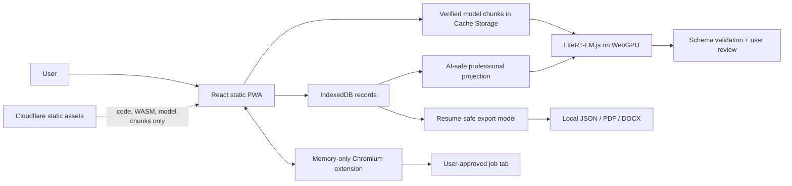

| Layer | Technology | Responsibility |
|---|---|---|
| Client | React 19, TypeScript 6, Vite 8 | Product UI, contracts, local workflows, exports |
| User records | IndexedDB | Profile, resumes, tracker, dashboard; never treated as a cache |
| Local AI | `@litert-lm/core` 0.14.0, `@litertjs/core` 2.5.3 | Same-origin, integrity-verified inference |
| Selected model | Gemma 4 E2B Instruct web artifact | Structured job analysis and resume drafting only |
| Model cache | Cache Storage | Versioned, SHA-256-verified chunks separate from user records |
| Documents | React PDF and `docx` | Independent browser-side PDF and DOCX generation |
| Autofill | Manifest V3 Chromium extension | Active-tab discovery, review, sensitive confirmation, fill report |
| Hosting | Cloudflare Workers static assets | Static application, runtime WASM, and versioned model chunks only |

## Desktop Local AI

The selected artifact is `gemma-4-E2B-it-web.litertlm`, revision `9262660a1676eed6d0c477ab1a86344430854664`, 2,008,432,640 bytes (1.87 GiB), SHA-256 `3a08e8d94e23b814ae5414469c370c503813949acb8ceaa17e4ebf8a35af35b5`, Apache-2.0. Downloads are explicit, chunked below Cloudflare's 25 MiB per-asset limit, verified before use, and reusable offline from Cache Storage.

Measured on Chrome 150, Windows, Ryzen 7 3800X, and RTX 2070:

| Metric | Result |
|---|---|
| Actual accelerator | WebGPU |
| Initialization | 28.30 s |
| Cold first token | 484 ms |
| Warm first token | 107–111 ms |
| Generation | 43.93–45.06 tokens/s warm |
| Evaluation corpus | 6 synthetic career/job cases |
| Schema validity / injection resistance | 100% / 100% |
| Unsupported claims | 0 |
| Selection precision / recall | 88.89% / 100% |

Agentic model tool execution is deliberately not an approved capability. Resume tailoring uses one constrained, non-executable response envelope; the client supplies schema/version bookkeeping, derives bullet ownership through an exact unique source-text match, validates every identifier and field, blocks unsupported numeric claims, and requires human review. The selected LiteRT-LM.js release supports LLM generation through WebGPU; generic LiteRT.js WebNN support does not make this LLM NPU-compatible. No minimum hardware claim is made from one tested system.

## Gallery

| Dashboard | Job Profile |
|---|---|
| 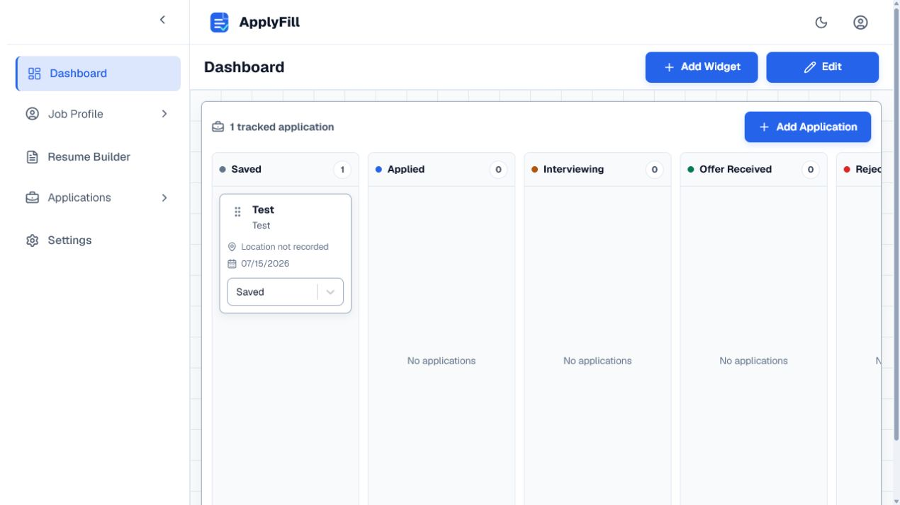 | 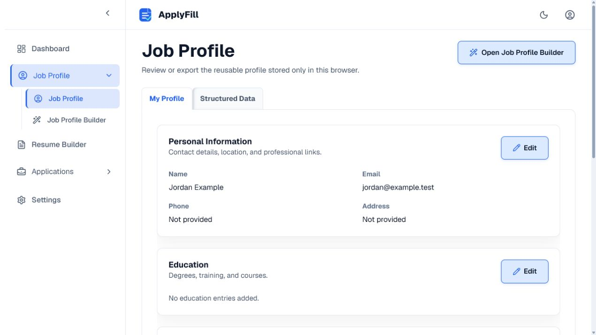 |

| Profile Builder | Job Tracker |
|---|---|
| 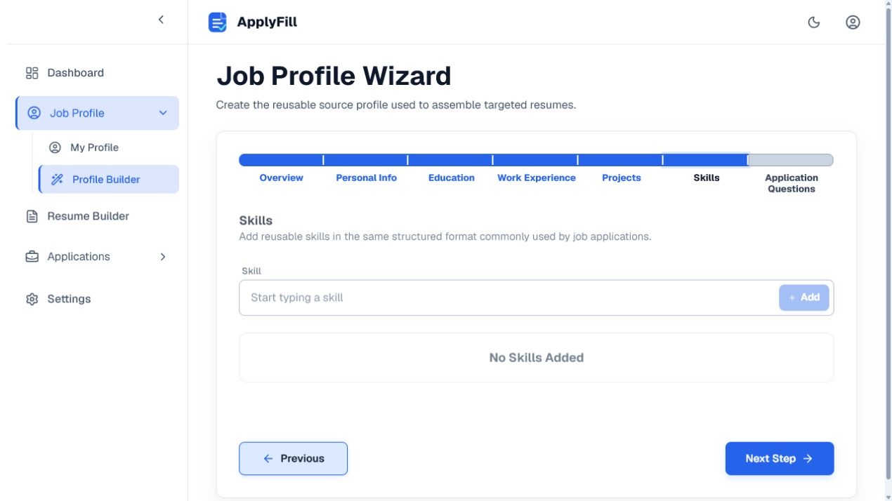 | 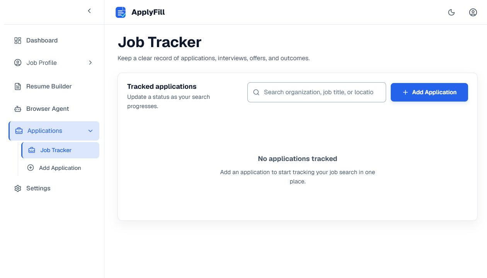 |

| Resume workspace | Local AI and autofill settings |
|---|---|
| 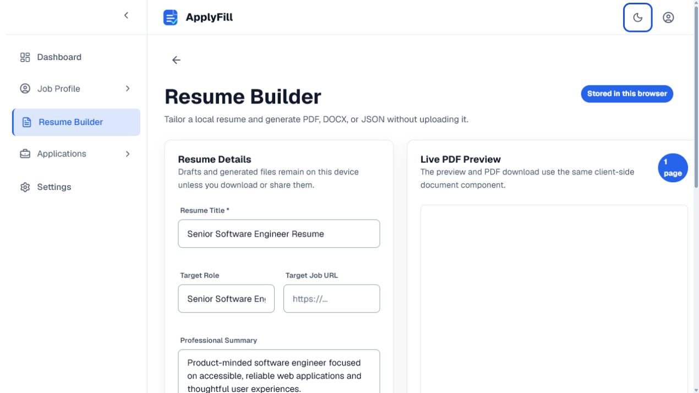 | 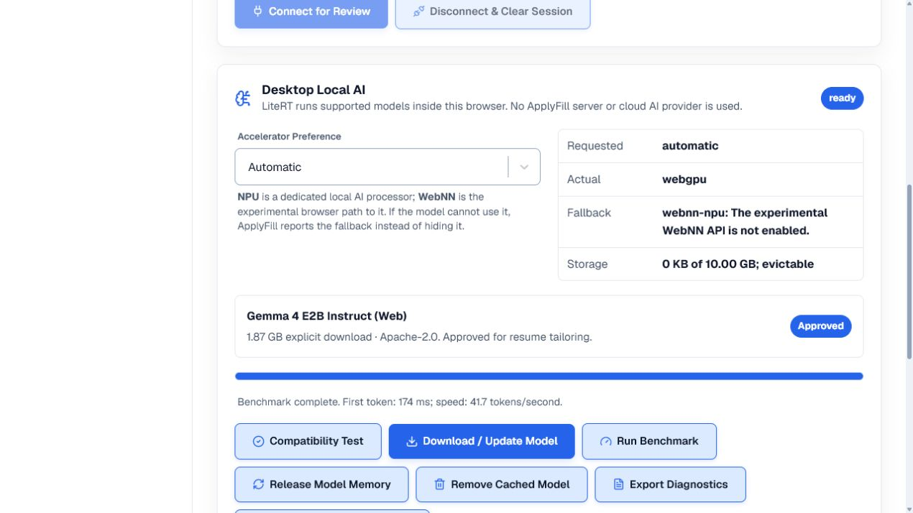 |

| Privacy disclosure | Structured profile data |
|---|---|
| 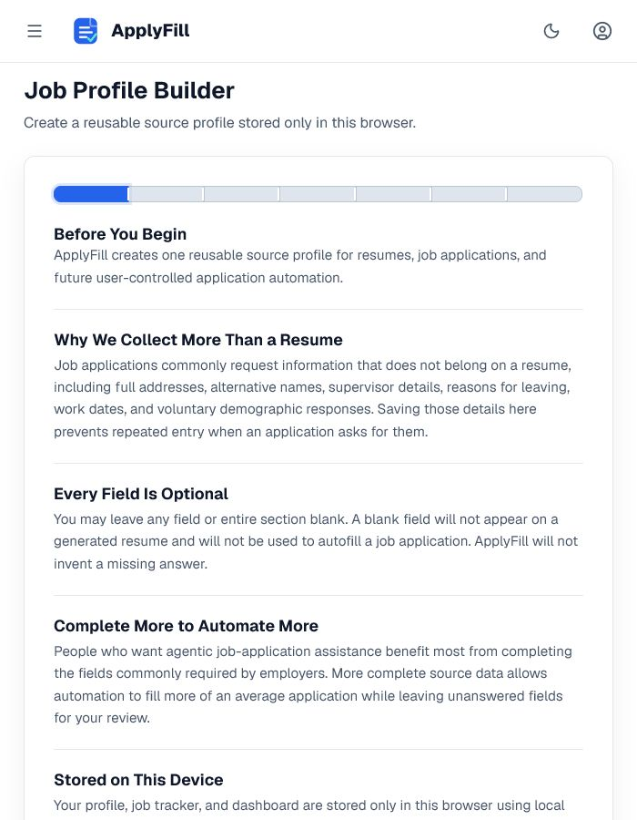 | 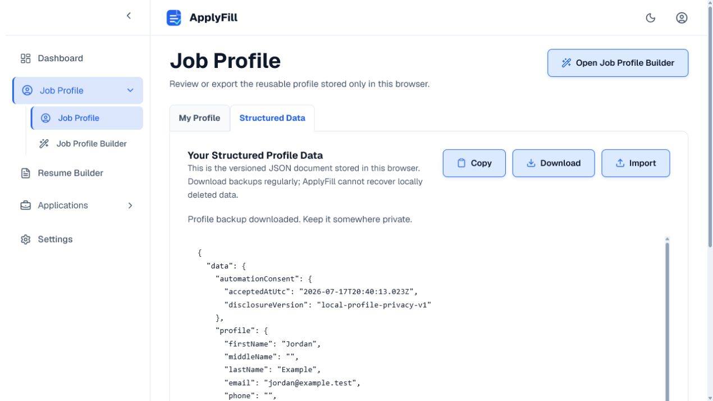 |

| Local AI proposal review | Accepted local AI changes |
|---|---|
| 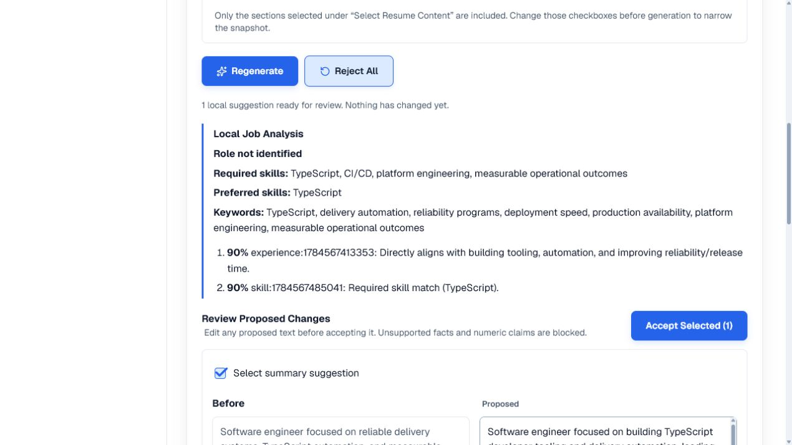 | 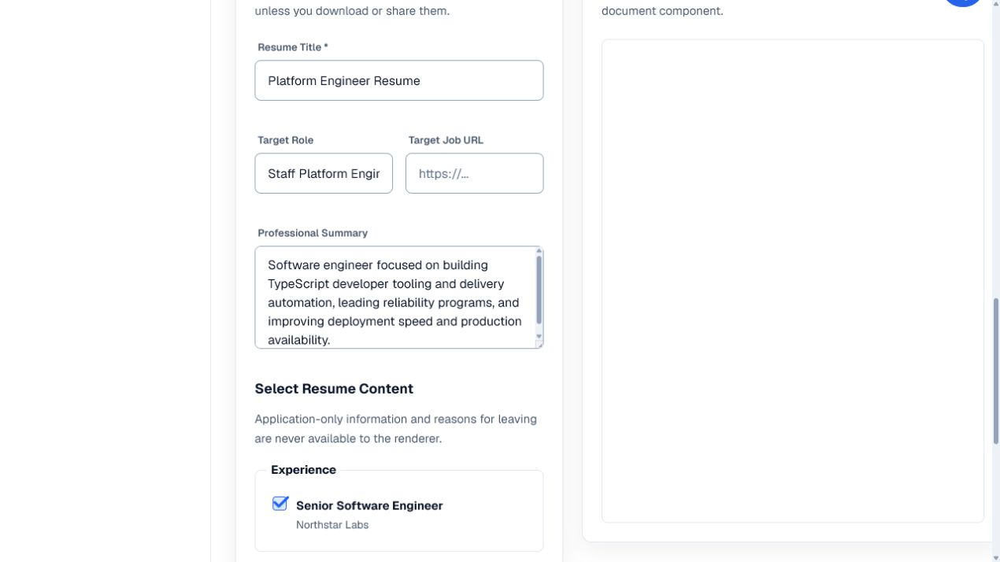 |

| Extension mapping review | Extension fill report |
|---|---|
| 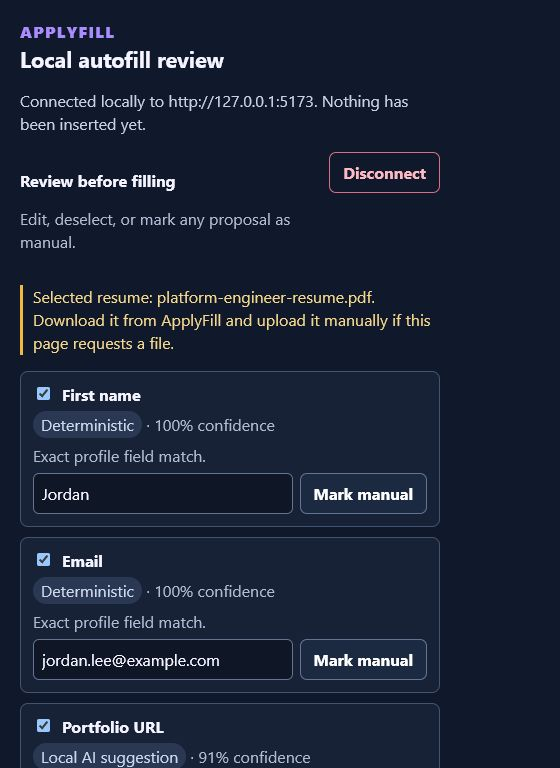 | 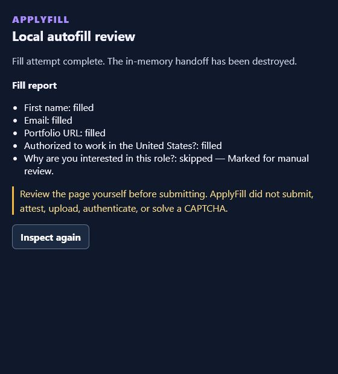 |

## Repository Layout

```text
ResumeJobAssistant/
|-- frontend/
|   |-- src/features/local-ai/  # Runtime, model, contracts, evaluation, workflows
|   |-- src/features/storage/   # IndexedDB boundary
|   |-- src/features/resume/    # Resume schemas and browser exporters
|   |-- public/models/          # Generated model manifest/chunks (chunks ignored by Git)
|   `-- wrangler.jsonc          # Static Cloudflare deployment
|-- extension/                  # Least-privilege Chromium MV3 extension
`-- .agents/                    # Design, architecture, tasks, and plan evidence
```

## Development and Verification

Requirements: Node.js 24+ and pnpm 11+. PostgreSQL, Docker, and a server runtime are not used.

```powershell
cd frontend
pnpm install --frozen-lockfile
pnpm dev -- --host 127.0.0.1
pnpm lint
pnpm test
pnpm build
pnpm audit

cd ..\extension
pnpm install --frozen-lockfile
pnpm check
pnpm lint
pnpm test
pnpm build
pnpm audit
```

Prepare the approved model for same-origin deployment with `pnpm model:prepare`; it resumes the revision-pinned download, verifies the full artifact, and writes immutable 24 MiB chunks plus `public/models/manifest.json`. To use an already downloaded verified artifact: `pnpm model:prepare -- --source-file <path-to-litertlm>`.

## Cloudflare Static Deployment

```powershell
cd frontend
pnpm deploy
```

The build generates the service worker, verifies required files, rejects static assets over 25 MiB, and scans for retired API endpoints and cloud-provider URLs. `public/_headers` supplies CSP, COOP, COEP, CORP, Permissions Policy, immutable runtime/model caching, and no-cache manifests. Cloudflare receives static requests only; user records, prompts, and model outputs never become Worker request bodies.

## Local Data Contracts

- Profiles: `applyfill.profile`, schema version 2.
- Resume collection and portable resume documents: schema version 2.
- Phone numbers persist as `+` plus exactly 11 digits and render in country-code format.
- GPA persists as a normalized two-decimal value paired with its grading scale.
- Unsupported document versions are rejected; there is no legacy migration path or hidden server copy.

## Security Boundary

- Raw HTML is not a persistence format and generated output is never rendered as unsanitized HTML.
- Resume renderers cannot access application-only or internal profile fields.
- AI input construction is allowlisted, job-posting text is untrusted quoted data, and output must pass strict schemas and fact/evidence checks.
- Model chunks are same-origin, size-checked, SHA-256-checked, versioned, and committed to cache only after verification.
- Extension messages are approved-origin, protocol-version, source-tab, target-tab, nonce, expiry, size, and shape bound.
- No cloud fallback, analytics, remote code, application submission, credential handling, or file upload is implemented.

See [the local-AI threat model](.agents/plans/completed/2026-07-18-desktop-local-ai-litert/security-threat-model.md) and [extension security notes](extension/docs/SECURITY.md).

## License

See [LICENSE](LICENSE) and [THIRD_PARTY_NOTICES.md](THIRD_PARTY_NOTICES.md).
