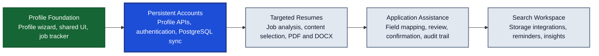

<div align="center">

  

  # ApplyFill

  **Enter job-application information once. Reuse it across applications and targeted resumes.**

  ApplyFill is a privacy-oriented profile builder and job-search workspace designed to replace repetitive application entry with structured, reusable data.

  <p>
    <a href="https://react.dev/"></a>
    <a href="https://www.typescriptlang.org/"></a>
    <a href="https://vite.dev/"></a>
    <a href="https://dotnet.microsoft.com/"></a>
    <a href="https://www.postgresql.org/"></a>
    <a href="https://www.npgsql.org/efcore/"></a>
    <a href="LICENSE"></a>
  </p>

</div>

---

## Project Overview

Most applicant-tracking systems ask for the same names, addresses, schools, jobs, dates, skills, demographic answers, and project details repeatedly. ApplyFill is being built around a different workflow: collect a complete source profile once, preserve it as structured data, and reuse the appropriate fields whenever a job application or targeted resume needs them.

The application currently provides a customizable dashboard, a substantial profile-building workflow with a review screen, a local job tracker, regional date preferences, and early resume-workspace routes. The longer-term product direction is to use the resulting structured profile for targeted resume generation and user-controlled agentic application assistance.

## Project Roadmap

The roadmap is ordered by technical dependency rather than speculative release dates. Each phase builds on the structured data and privacy boundaries established by the previous phase.



| Phase | Status | Intended outcome |
| --- | --- | --- |
| Profile foundation | Implemented and being refined | Capture reusable profile records, preserve browser-local progress, and track job applications through consistent accessible components. |
| Persistent accounts | Next | Connect profile and tracker workflows to authenticated APIs, PostgreSQL persistence, migration-safe records, and recoverable user data. |
| Targeted resumes | Planned | Analyze a target job, select relevant source-profile content, generate tailored documents, preview layouts, and export PDF/DOCX versions. |
| Application assistance | Planned | Map saved answers into application fields with explicit user review, confirmation controls, and an auditable application history. |
| Search workspace | Later | Add optional document-storage integrations, reminders, and job-search progress insights. |

Diagram key: green is implemented, blue is the next major phase, and gray is planned. Scope and ordering may evolve as privacy, accessibility, and data-integrity requirements are validated.

### Core Objectives

- **Single source profile:** Maintain reusable personal, education, employment, project, and skills records instead of retyping them for each employer.
- **Application-aware data:** Capture details that resumes omit but application forms often request, including alternative names, reasons for leaving, date precision, veteran status, and disability status.
- **Privacy-oriented operation:** Support local use and keep AI provider credentials on the backend rather than collecting them in profile screens.
- **Accessible, consistent interaction:** Use shared form, modal, date-picker, select, checkbox, tooltip, rich-text, and repeatable-entry components across light, dark, desktop, and mobile layouts.
- **Structured automation foundation:** Model profile, resume, job target, application packet, and application log data so later automation can operate on explicit records instead of scraping free-form documents.

---

## Current Features

### Reusable Profile Builder

The Job Profile area includes a review screen and a profile wizard. The wizard provides clickable progress navigation and automatically preserves the current browser session as the user moves between sections.

- **Personal information:** First, optional middle, and last names; email; phone; repeatable alternative names; country-aware addresses; and repeatable web links.
- **Education:** Degrees, diplomas, courses, vocational training, providers, locations, exact or estimated dates, current enrollment, and rich-text details.
- **Work experience:** Repeatable jobs with employer details, country-aware location fields, supervisor information, exact or estimated dates, current-job handling, experience details, and reason for leaving.
- **Projects:** Professional, academic, volunteer, open-source, and personal projects with roles, organizations, links, dates, ongoing status, and rich-text outcomes.
- **Skills:** Searchable skill suggestions, custom skill entry, duplicate prevention, and an explicit proficiency level for each saved skill.
- **Application questions:** Optional race and ethnicity, veteran-status, and disability-status answers for application automation. These answers are not intended for generated resumes.

Repeatable records are added and edited in a shared modal workflow with validation, unsaved-change protection, responsive layouts, and consistent destructive actions. Education and employment records can be sorted with the most recent entry first by default.

### Dashboard And Preferences

- **Customizable dashboard:** A responsive widget grid starts with an application-pipeline board. Users can add editable rich-text note widgets, rearrange or resize widgets while editing, and reset the dashboard layout.
- **Regional preferences:** Settings include a persisted choice between month/day/year and day/month/year date formats.
- **Theme and navigation:** The shared application shell supports responsive navigation and a persisted light or dark theme.

### Job Tracker

The job tracker records company, role, location, posting URL, application date, status, and formatted notes. Entries can be searched, filtered by status, updated in place, opened at their source posting, or removed.

### AI-Assisted Editing

The backend exposes optional Gemini-powered endpoints for improving experience and project descriptions. Provider credentials are read from backend configuration; they are not entered into or retained by the browser UI.

### Resume Workspace

Resume-version and builder routes establish the interface for target-specific resumes, content selection, previews, and exports. PDF/DOCX generation and completed resume persistence remain under development and are not presented as finished functionality.

---

## Application Gallery

The following screenshots were captured from the current frontend in July 2026.

| Dashboard | Job Profile review |
| --- | --- |
|  |  |
| Job Profile builder | Job tracker |
|  |  |
| Resume workspace | Settings |
|  |  |

### Profile Builder Detail Gallery

| Personal information | Education details |
| --- | --- |
|  |  |
| Work experience | Projects |
|  |  |
| Skills autocomplete | Optional application questions |
|  |  |

---

## Architecture

ApplyFill separates the interactive client from the domain and persistence layers so the profile schema can support more than a single resume editor.

| Layer | Technologies | Responsibility |
| --- | --- | --- |
| Frontend | React 19, TypeScript 6, Vite 8, React Router 7 | Profile wizard, job tracker, resume workspace, responsive application shell |
| UI foundation | React Select, Tiptap, Lucide React, shared CSS tokens and primitives | Accessible selects, structured rich text, dates, modals, tooltips, checkboxes, icons, and consistent states |
| API | ASP.NET Core 10, OpenAPI, typed `HttpClient` | HTTP endpoints, development authentication, AI-service boundary |
| Application | .NET class library | Service contracts and application-level integrations |
| Domain | .NET class library | Users, profiles, resumes, projects, skills, job targets, application packets, and logs |
| Infrastructure | Entity Framework Core 10, Npgsql | PostgreSQL persistence, entity mappings, and migrations |
| Worker | .NET Worker Service | Background-processing host reserved for asynchronous workflows |
| Verification | TypeScript compiler, Oxlint, xUnit, Coverlet | Frontend checks and backend test/coverage foundation |

### Current Data Boundaries

- Profile-builder progress is stored in browser `localStorage` under an ApplyFill-specific key.
- Job-tracker entries are also stored in browser `localStorage`.
- The PostgreSQL domain schema and migrations exist, but the frontend profile and tracker workflows are not yet connected to full persistence APIs.
- Gemini calls originate from the backend. The API key is never required in the frontend application.
- Rich-text fields persist only a restricted structured document. Raw HTML is not accepted or rendered; AI output is treated as plain text and converted directly into that document shape.

This distinction matters for local users: clearing site data currently removes browser-stored profile and tracker information.

---

## Repository Structure

```text
ApplyFill/
|-- frontend/                         # React and Vite client
|   |-- public/
|   |   `-- readme/                  # README gallery screenshots
|   `-- src/
|       |-- components/
|       |   |-- brand/               # Reusable ApplyFill branding
|       |   |-- layout/              # Navbar, sidebar, and application shell
|       |   |-- resume/              # Profile-builder sections and rich text
|       |   `-- ui/                  # Shared form and interaction primitives
|       |-- constants/               # Brand, locations, and skills taxonomy
|       `-- pages/                   # Dashboard, profile, resumes, tracker, settings
|-- src/
|   |-- ResumeBuilder.Api/            # ASP.NET Core API
|   |-- ResumeBuilder.Application/    # Application services and AI boundary
|   |-- ResumeBuilder.Domain/         # Entities and enums
|   |-- ResumeBuilder.Infrastructure/ # EF Core context and migrations
|   `-- ResumeBuilder.Worker/         # Background worker host
|-- tests/ResumeBuilder.Tests/         # xUnit test project
|-- .agents/                           # Agent design, planning, and task guidance
|-- LICENSE                            # Personal local-use source license
`-- ResumeBuilder.sln                  # .NET solution entry point
```

Repository-specific implementation guidance lives in [`.agents/`](.agents/README.md). The root README describes the product; agent documents preserve design rules, architecture decisions, and implementation history.

---

## Getting Started

### Prerequisites

- [Node.js](https://nodejs.org/) 22 or newer
- [pnpm](https://pnpm.io/) 11 or newer
- [.NET SDK 10](https://dotnet.microsoft.com/download/dotnet/10.0)
- [PostgreSQL](https://www.postgresql.org/download/) for the backend API
- A Gemini API key only when testing optional AI-assisted editing

The frontend can be run independently for profile-builder and job-tracker development. The API is required for AI enhancement requests.

### 1. Clone the Repository

```powershell
git clone https://github.com/tuckthomas/ApplyFill.git
cd ApplyFill
```

### 2. Start the Frontend

```powershell
cd frontend
pnpm install --frozen-lockfile
pnpm dev -- --host 127.0.0.1
```

Open [http://127.0.0.1:5173](http://127.0.0.1:5173). Vite will select another port if `5173` is already occupied.

### 3. Configure PostgreSQL

Create a local database named `ResumeBuilder`, then supply its connection string through configuration. PowerShell example:

```powershell
$env:ConnectionStrings__DefaultConnection = "Host=localhost;Port=5432;Database=ResumeBuilder;Username=postgres;Password=YOUR_PASSWORD"
```

Do not commit local passwords or provider credentials. Local `.env` files, development app settings, and `secrets.json` are ignored by Git.

### 4. Start the API

The frontend's current AI actions expect the development API at `http://localhost:5033`:

```powershell
$env:ASPNETCORE_ENVIRONMENT = "Development"
dotnet restore
dotnet run --project src/ResumeBuilder.Api --no-launch-profile --urls http://localhost:5033
```

In Development, the API applies pending Entity Framework migrations and creates a local development user when needed.

### 5. Enable Optional AI Editing

Set the provider key in the API process before starting it:

```powershell
$env:GEMINI_API_KEY = "YOUR_GEMINI_API_KEY"
```

The key belongs in backend environment configuration or .NET user secrets, never in frontend source, Vite environment variables, browser storage, or committed settings.

---

## Development Commands

### Frontend

```powershell
cd frontend
pnpm dev       # Start the Vite development server
pnpm build     # Type-check and produce a production bundle
pnpm lint      # Run Oxlint
pnpm preview   # Preview the production bundle locally
```

### Backend

```powershell
dotnet restore
dotnet build
dotnet test
```

The solution targets .NET 10 LTS. Use `dotnet --version` to confirm that a 10.x SDK is active before restoring or building.

To add a database migration after changing the persistence model:

```powershell
dotnet ef migrations add MigrationName `
  --project src/ResumeBuilder.Infrastructure `
  --startup-project src/ResumeBuilder.Api
```

---

## Product Status

ApplyFill is under active development.

| Area | Status |
| --- | --- |
| Reusable profile wizard | Implemented in the frontend |
| Job Profile review screen | Implemented with local profile data |
| Customizable dashboard | Implemented with browser-local widgets and layouts |
| Responsive light and dark themes | Implemented |
| Job-application tracker | Implemented with browser-local persistence |
| Regional date-format preference | Implemented with browser-local persistence |
| AI-assisted experience/project editing | Implemented through backend endpoints |
| PostgreSQL domain model and migrations | Implemented |
| Profile and tracker persistence APIs | Planned |
| Targeted resume generation and preview | Interface scaffolded; generation planned |
| PDF and DOCX export | Planned |
| Agentic application filling | Planned |
| Cloud storage integrations | Planned |

---

## Privacy and Sensitive Information

ApplyFill handles information that may be sensitive, including employment history and optional demographic answers. Current local browser storage is convenient for development but is not a substitute for encrypted production persistence, authentication, backups, access controls, or a formal privacy review. Do not use the current development build as a shared or public production service.

Optional demographic, veteran-status, and disability-status answers are collected only to support future user-directed application automation. They are explicitly excluded from the intended generated-resume content model.

---

## License

ApplyFill is source-available under the [ApplyFill Personal Local-Use License 1.0](LICENSE). Individuals may run and modify private local copies for their own job search.

Public deployment, redistribution, hosted access, commercial use, business or organizational use, and reuse of any component or workflow in another product are prohibited without a separate written license. This is **not** an open-source license.
